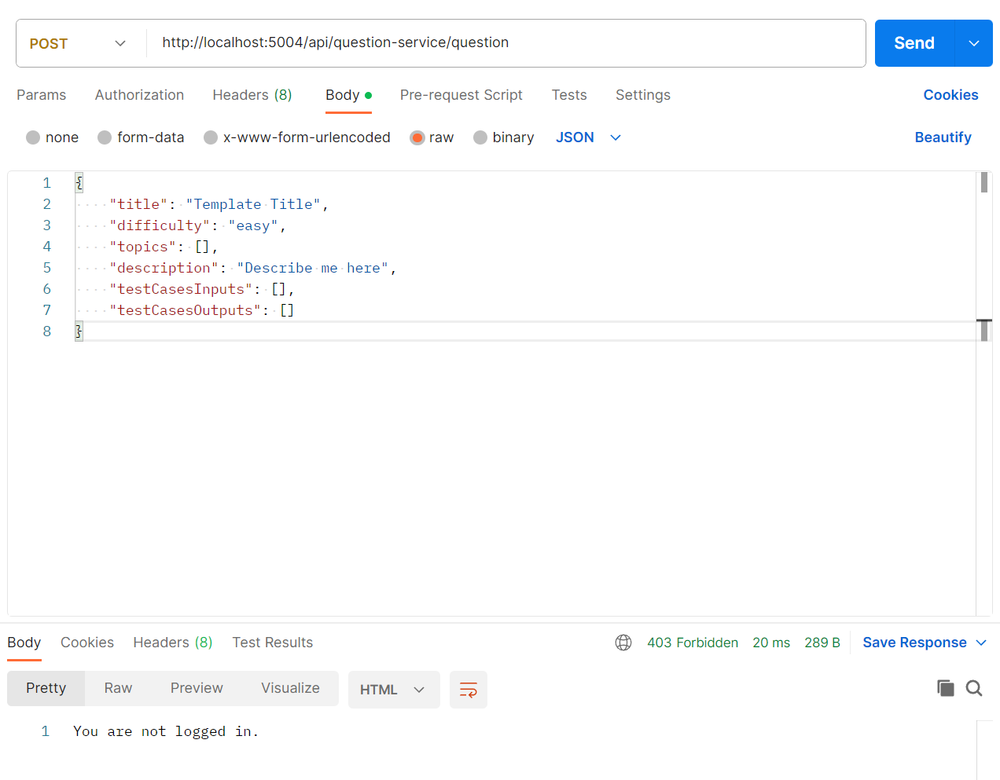

# Test cases for non-logged in users

Normally, when non-logged in users who attempt to access the `/questions` page on the frontend, they will be redirected to 
the home page. In order to test that these users cannot perform any operations directly on the question database,
you may use the following links and payloads on a tool like Postman after starting up the question service:

## Test Case 1: GET list of questions
Link and method:
```
GET http://localhost:5004/api/question-service/list?body=%7B%22page%22%3A0%2C%22limit%22%3A10%2C%22difficulty%22%3A%5B%22easy%22%2C%22medium%22%2C%22hard%22%5D%2C%22sort%22%3A%7B%22title%22%3A1%7D%7D
```

## Test Case 2: POST new question
Link and method:
```
POST http://localhost:5004/api/question-service/question
```

Payload (using raw JSON in Postman):
```
{
    "title": "Template Title",
    "difficulty": "easy",
    "topics": [],
    "description": "Describe me here",
    "testCasesInputs": [],
    "testCasesOutputs": []
}
```

Screenshot below to illustrate:



## Test Case 3: PUT update for a question
Link and method:
```
PUT http://localhost:5004/api/question-service/question/0123456789abcdef
```

Payload (using raw JSON in Postman):
```
{
    "title": "Template Title",
    "difficulty": "easy",
    "topics": [],
    "description": "Describe me here",
    "testCasesInputs": [],
    "testCasesOutputs": []
}
```

## Test Case 4: DELETE a question
Link and method:
```
DELETE http://localhost:5004/api/question-service/question/0123456789abcdef
```

## Test Case 5: GET a question
Link and method:
```
GET http://localhost:5004/api/question-service/question/0123456789abcdef
```

## Note about question IDs
In the above test cases, we can use non-existent question IDs since the login verification is done before actually
attempting to retrieve the question. So the 403 Error for non-logged in users will appear instead of 404 Not Found.
