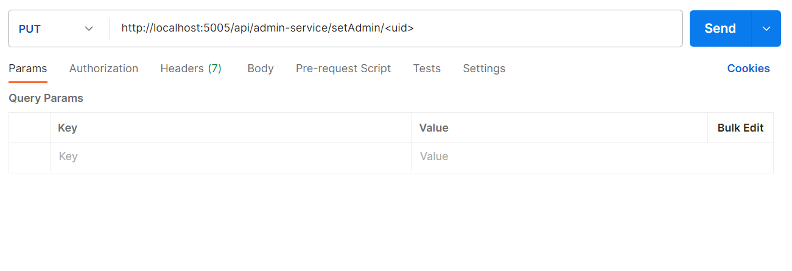

# Admin Service

## Introduction
The admin service is a microservice meant to be used by administrators of the application to do privileged actions on Firebase.

Administrators are defined using Firebase custom claims. An app user with the below custom claim is an administrator:
```
{ admin : true }
```

Examples of privileged actions handled by this service include:
* Setting someone as an administrator
* Removing administrator privileges from someone
* Listing out all users that are stored in the application's Firebase Authentication database

Note: 
* As all backend services are assumed to be run within a secure environment, the admin service itself will not verify if the API request comes from an administrator
* For verification of whether the request originates from an administrator, the verification is done by the gateway service.

## How to run the service locally for development
The command to run at the root of the entire project is as follows:
```
yarn workspace admin-service dev:local
```

This will read in a file named `.env` for environment variables. Therefore, your `.env` file needs this variable set:
```
FIREBASE_SERVICE_ACCOUNT
```

This corresponds to the service account for the project's development environment on Firebase itself. 

## How to add/remove admin rights for users on the application

1. Run the command below. This will start up the admin service locally:
```shell
dotenv -e <insert full path of env file> -c development -- yarn dev
```

Although the command is `dev`, the Firebase admin rights can also be added to/removed from the users on the production
or development version of the application. This is because the users and roles are stored remotely on Firebase.

The application version affected depends on the value of 
the `FIREBASE_SERVICE_ACCOUNT` environment variable in `<insert full path of env file>`.

Hence, if your `FIREBASE_SERVICE_ACCOUNT` environment variable has the service account for the production application,
the admin rights will be added to users registered in the production app.

1. To set admin rights on a user, make a `PUT` request with `uid` corresponding to the user's uid in the Firebase project
corresponding to the application version. You can do this using a tool like [Postman](https://www.postman.com/), 
which you need to install separately.

```
http://localhost:5005/api/admin-service/setAdmin/<uid>
```



1. To remove admin rights from the same user, make a `PUT` request with the same `uid`.
```
http://localhost:5005/api/admin-service/removeAdmin/<uid>
```

### Shortcut

If you are setting/removing admin rights for users on the dev environment, you can simply run:
```shell
yarn workspace admin-service dev:local
```

This uses the default `.env` file which has a `FIREBASE_SERVICE_ACCOUNT` corresponding to the development app.

## How to do automated testing
Automated testing is done using a [Firebase Local Emulator Suite](https://firebase.google.com/docs/emulator-suite).
The README file at the project root has more details on this. Be sure to read that before trying to run any tests here.

To run the unit tests locally, run this command at the project root:
`yarn workspace admin-service test`

To run the system tests locally, run this command at the project root:
`yarn workspace admin-service systemtest`

You may also run them in CI. In such a case, you need to provide the environment variables manually:
```
yarn workspace admin-service test:ci
yarn workspace admin-service systemtest:ci
```